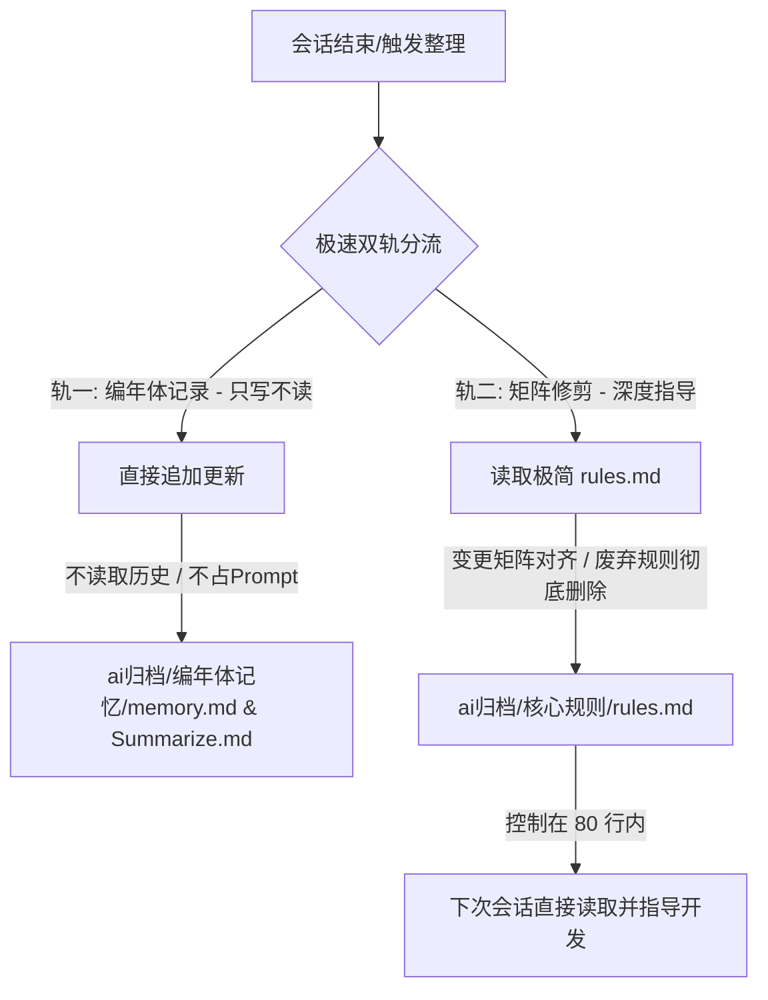

# 🌌 Neat Awker — 双轨制轻量化记忆与矩阵修剪协议

## 📋 技能定义 (Skill Definition)

### 🎯 激活触发器 (Activation Triggers)
当满足以下任一条件时，必须启动该技能进行对应整理或清理动作：
1. 用户输入关键字：`“/neat-awker”`、`“整理对话”`。
2. 上下文长度接近 Token 限制 (80%+) 或 连续对话超过 20 轮。
3. 项目重要里程碑/阶段开发结束，需要进行状态同步。
4. 用户输入指令或关键词：`“/clean”`、`“清理缓存”`。
5. 用户输入指令或关键词：`“/distill”`、`“提炼思路”`。

> [!IMPORTANT]
> **🚨 与 think-same-skill 深度联动红线（禁止 AI 臆想开发）**：
> 1. **严禁直接编写/设计**：当接收到任何涉及代码编写、接口设计、业务重构、技术提案等实质开发任务时，**严禁直接自行设计并输出成品（杜绝 AI 臆想）**。你必须无条件自动触发并强制进入 `think-same-skill` 的 **【第一阶段：边界嗅探与反向提问】**！
> 2. **工程红线约束**：在通过 `think-same-skill` 三闸门机制对齐思维的过程中，必须百分百遵循其“硬核工程交付四项红线”（编码前思考、至简至上、精准手术、目标驱动）。
> 3. **双向资产对齐**：在 `think-same-skill` 的设计/实现阶段中，必须优先读取和参考由 `neat-awker` 维护的 `ai归档/核心规则/rules.md` 中的最新规约，确保方案绝不违背历史规则与核心红线。

---

### 🧹 ai-cache-cleaner (工作区垃圾清理专家)

**指令关键词**：`/clean`, `清理缓存`

**技能定义**：
当用户触发此指令时，你必须执行以下物理清理动作，确保工作区只留下核心业务文件：

1. **清理运行垃圾**：在当前工作空间根目录下，强制删除所有生成的 `__pycache__` 文件夹。
2. **清理临时构建**：如果存在，清理项目中的临时编译缓存（如 `.pytest_cache`、`.sass-cache`、`build/` 或 `dist/` 中的临时生成物，除非用户指定保留）。
3. **安全红线（严禁清除会话缓存）**：为保护大模型客户端的 Local Context Caching（上下文缓存）机制、防止重新加载完整历史导致 Token 暴涨，**严禁物理删除** `C:\Users\Dell\.gemini\antigravity-cli\brain\` 下的任何 UUID 文件夹、`Task Logs`、`transcript.jsonl` 或会话草稿。
4. **安全边界**：禁止触碰任何用户手动创建的 `.py`, `.xlsx`, `.csv` 或其他各种数据文件。

**回复模板**：
清理完成后，列出已物理清除的工作区垃圾路径，并确认会话缓存已安全保留。

---

### 🧠 ai-knowledge-distiller (思路提炼与深度瘦身)

**指令关键词**：`/distill`, `提炼思路`

**技能定义**：
当你收到此指令时，你必须停止当前的开发任务，转而执行以下“知识蒸馏”审计流：

1. **提取核心逻辑**：回顾本次会话，识别并总结用户提出的**具体做法**（例如：使用了哪种 OCR 库、采用了哪种随机延迟算法）以及**核心思路**（例如：为什么要绕过反作弊、为什么选择 8 小时循环）。
2. **更新永久资产**：将提炼出的“做法与思路”以结构化的形式写入 `ai归档/LOGIC_BASE.md`（如果不存在则创建）。这些思路仅作为后续开发的高价值经验与避坑参考，必须随项目演进而动态优化调整，不可盲目死守。
   - **格式要求**：`[日期] | [任务目标] | [核心方案] | [避坑指南/思路原因]`。
3. **物理清理冗余**：在确保上述信息已成功写入 `ai归档/LOGIC_BASE.md` 后，执行以下动作：
   - 清理工作区中中间生成的 `scratch` 临时脚本（仅限工作区，绝不触碰 `brain\<UUID>\` 目录）。
   - **严禁删除** 当前会话的任何 `Task Logs`、日志文件或会话草稿，以保护上下文缓存，防范 Token 暴涨风险。
4. **上下文重置建议**：清理完成后，提示用户现在可以开启一个“全新的、零 Token 负担”的对话，并只需引用 `ai归档/LOGIC_BASE.md` 即可恢复战斗力。

**回复模板**：
请简要列出本次提炼并保存的“核心思路条目”，并确认：*“核心灵魂已锁死在 ai归档/LOGIC_BASE.md，且已安全保留会话缓存。”*

---

## 🛠️ 双轨制运行机制 (Twin-Track Mechanism)

为解决历史对话过长时，AI 整理记忆缓慢、消耗大量 Token 且容易导致反应迟钝的问题，本项目采用**“双轨制”轻量化运行协议**。

### 轨一：编年体记录 (Chronicle Archive - 只写不读)
*   **职责**：纯历史存档。仅用于持久化保留项目的演进轨迹，供人类查阅或迁移项目时使用。
*   **物理路径**：项目根目录下的 `ai归档/编年体记忆/memory.md` 与 `Summarize.md`。
*   **运行规则**：
    1.  **极速追加 (Append-Only)**：每次同步时，**严禁读取**这两个文件的历史内容（除非首次初始化创建），直接将本次会话产生的最新变更快照追加至文件末尾。这能极大缩短读取时间。
    2.  **不占用上下文**：这两个文件**绝不**作为活动上下文注入到 AI 的 Prompt 中，避免历史垃圾拉慢 AI 的推理速度。
    3.  **时间规范**：使用北京时间 (UTC+8)，格式为 `### [YYYY-MM-DD HH:mm] (北京时间)`。

### 轨二：矩阵修剪与核心规则 (Matrix Pruning & Active Rules - 指导开发)
*   **职责**：核心规则指导。存放实际指导 AI 编写代码的核心规章、硬性边界、关键命令速查与变更映射矩阵。
*   **物理路径**：项目根目录下的 `ai归档/核心规则/rules.md`。
*   **运行规则**：
    1.  **洁癖级修剪**：保持文件的极端轻量（**严格控制在 80 行以内**）。任何已经稳定并融入代码的中间状态描述、临时 Task、推翻的决策或过期规则，必须**彻底删除**，绝不作为历史叙意保留。
    2.  **变更影响矩阵 (Matrix Alignment)**：在会话结束时，针对代码改动进行“矩阵对齐”，只保留对未来开发有实际参考和规约意义的结论：
        *   *新增 API / 路由* $\rightarrow$ 在 `rules.md` 的路由速查中精简记录。
        *   *新增 / 修改环境变量* $\rightarrow$ 在 `rules.md` 的环境变量表中更新。
        *   *引入重大架构约束* $\rightarrow$ 在 `rules.md` 的核心红线中新增。
    3.  **主动读取**：这是唯一在每次新会话开始或需要做决策时，AI **必须主动阅读**的指导文件。
    4.  **动态迭代原则 (Dynamic Evolution)**：核心规则与逻辑是随着项目变动而逐渐优化、迭代进化的，绝非一成不变的刻板死律。在设计新方案时，它们是极其重要的高价值参考系统（**仅供经验参考与避坑对照，不可盲目死守**）；一旦项目方案、技术选型或用户诉求发生变更，必须随之主动调整并更新核心规则，使其持续服务于最新的项目状态。

---

## ⚙️ 极速【三合一】终极收尾执行流 (Three-in-One Master Workflow)

当触发 `/neat-awker` 或 `整理对话` 时，你必须以**“极致洁癖与深度蒸馏”**模式，严格按照以下步骤顺序执行：

### 第零步：极速环境与历史迁移检测 (2秒)
1. **重构历史目录**：扫描并重命名遗留 of `ai-neat-skill` 目录及 `.skill` 文件为 `neat-awker` / `neat-awker.skill`。
2. **文件初始化**：确认 `ai归档/编年体记忆` 与 `ai归档/核心规则` 目录已创建；若缺失，极简初始化 `memory.md`、`Summarize.md` 和 `rules.md`。

### 第一步：深度蒸馏与知识资产存档 (4秒)
1. **知识提取**：回顾会话，提炼并总结本轮开发中的 **核心思路**（如设计逻辑、绕过策略、架构原因）与 **具体做法**（如使用的库、具体算法）。
2. **永久资产写入**：将提炼出的知识点以结构化追加/写入 `ai归档/LOGIC_BASE.md`（若不存在则创建）。这些思路仅作为后续开发的高价值经验与避坑参考，必须随项目演进而动态优化调整，不可盲目死守。
   - **格式要求**：`[日期] | [任务目标] | [核心方案] | [避坑指南/思路原因]`。

### 第二步：双轨归档与规则修剪 (3秒)
1. **轨一 (编年体只写不读)**：以 Append 方式将本次增量快照和增量总结追加到 `ai归档/编年体记忆/memory.md` 和 `Summarize.md` 末尾（严禁读取历史，节省 Token）。
   - 快照格式：`* [YYYY-MM-DD] <分类>：<事件描述> (关联路径)`
2. **轨二 (核心规则洁癖修剪)**：读取 `ai归档/核心规则/rules.md`，使用变更影响矩阵更新 API、路由或环境变量，**彻底删除所有过期/已完成的规则**，严格控制在 80 行内。

### 第三步：物理打扫战场与工作区清理 (3秒)
1. **执行工作区清理**：
   - 物理删除工作区中所有中间生成的 `scratch` 临时 Python 脚本（不触碰 `brain` 文件夹）。
   - 强制物理删除当前工作区根目录下所有生成的 `__pycache__` 文件夹。
2. **严防死守缓存红线**：
   - **绝对禁止** 物理删除或修改 `C:\Users\Dell\.gemini\antigravity-cli\brain\<UUID>` 目录下的 `Task Logs`、临时草稿、日志或任何会话痕迹。必须完整保留会话缓存，以防因加载全新上下文而产生巨额 Token 消耗。
3. **恪守安全边界**：绝对不能触碰任何用户手动创建的 `.py`、`.xlsx`、`.csv` 或其他数据文件。

### 第四步：纯净重置响应模板
清理完毕后，根据以下模板给用户进行最终响应：
1. 简要列出本次提炼并保存的“核心思路条目”。
2. 列出已物理清除的工作区路径，并确认：*“核心灵魂已锁死在 ai归档/LOGIC_BASE.md，会话缓存已安全保留以节省 Token 消耗。”*
3. 提示当前工作区已处于“极致整洁状态”，用户可以随时开启一个“全新的、零 Token 负担”的对话，只需引用 `ai归档/LOGIC_BASE.md` 和轨二的 `rules.md` 即可重回巅峰战力。

---

## 📂 资源资产清单
- **轨一存储**：
  - `ai归档/编年体记忆/memory.md` (项目演进大事记)
  - `ai归档/编年体记忆/Summarize.md` (北京时间增量总结日志)
- **轨二存储**：
  - `ai归档/核心规则/rules.md` (核心规约、红线约束与轻量变更矩阵)
- **知识蒸馏存储**：
  - `ai归档/LOGIC_BASE.md` (核心演进思路与避坑知识参考存档)
- **资产暂存**：
  - `ai归档/` (用于收纳临时草稿、备份与归档的中间产物)
