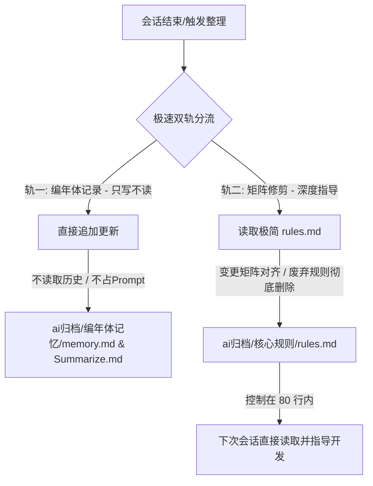

# 🌌 Neat Awker — 双轨制轻量化记忆与矩阵修剪协议

## 📋 技能定义 (Skill Definition)

### 🎯 激活触发器 (Activation Triggers)
当满足以下任一条件时，必须启动该技能进行收尾整理：
1. 用户输入关键字：`“编年史”`、`“/neat-awker”`、`“整理记忆”`、`“同步到根目录”`、`“/sync-root”`、`“收尾”`、`“整理文档”`。
2. 上下文长度接近 Token 限制 (80%+) 或 连续对话超过 20 轮。
3. 项目重要里程碑/阶段开发结束，需要进行状态同步。

---

## 🛠️ 双轨制运行机制 (Twin-Track Mechanism)

为解决历史对话过长时，AI 整理记忆缓慢、消耗大量 Token 且容易导致反应迟钝的问题，本项目采用**“双轨制”轻量化运行协议**。



### 轨一：编年体记录 (Chronicle Archive - 只写不读)
*   **职责**：纯历史存档。仅用于持久化保留项目的演进轨迹，供人类查阅或迁移项目时使用。
*   **物理路径**：项目根目录下的 `ai归档/编年体记忆/memory.md` 与 `Summarize.md`。
*   **运行规则**：
    1.  **极速追加 (Append-Only)**：每次同步时，**严禁读取**这两个文件的历史内容（除非首次初始化创建），直接将本次会话产生的最新变更快照追加至文件末尾。这能极大缩短读取时间。
    2.  **不占用上下文**：这两个文件**绝不**作为活动上下文注入到 AI 的 Prompt 中，避免历史垃圾拉慢 AI 的推理速度。
    3.  **时间规范**：使用北京时间 (UTC+8)，格式为 `### [YYYY-MM-DD HH:mm] (北京时间)`。

### 轨二：矩阵修剪与核心规则 (Matrix Pruning & Active Rules - 指导开发)
*   **职责**：核心规则指导。存放实际指导 AI 编写代码的核心规章、硬性边界、关键命令速查与变更映射矩阵。
*   **物理路径**：项目根目录下的 `ai归档/核心规则/rules.md`。
*   **运行规则**：
    1.  **洁癖级修剪**：保持文件的极端轻量（**严格控制在 80 行以内**）。任何已经稳定并融入代码的中间状态描述、临时 Task、推翻的决策或过期规则，必须**彻底删除**，绝不作为历史叙意保留。
    2.  **变更影响矩阵 (Matrix Alignment)**：在会话结束时，针对代码改动进行“矩阵对齐”，只保留对未来开发有实际参考和规约意义的结论：
        *   *新增 API / 路由* $\rightarrow$ 在 `rules.md` 的路由速查中精简记录。
        *   *新增 / 修改环境变量* $\rightarrow$ 在 `rules.md` 的环境变量表中更新。
        *   *引入重大架构约束* $\rightarrow$ 在 `rules.md` 的核心红线中新增。
    3.  **主动读取**：这是唯一在每次新会话开始或需要做决策时，AI **必须主动阅读**的指导文件。

---

## ⚙️ 极速轻量化执行流 (Lightweight Workflow)

> [!IMPORTANT]
> 每次执行必须保持**轻量和极速**。切忌在长会话中进行繁重的全文分析。

### 第零步：极速环境准备与历史迁移判断 (2秒)
1.  **历史兼容与向后迁移检测 (Migration Check - 自动运行)**：
    *   **检测旧命名与目录**：AI 需首先检测项目根目录及临时目录中是否存在名为 `ai-neat-skill` 的文件夹，若存在则重命名为 `neat-awker`；检测是否存在 `ai-neat-skill.skill` 文件，若存在则重命名为 `neat-awker.skill`。
    *   **旧文档内容规整**：检测 `ai归档/` 下的任何历史记录文件（如 `memory.md`、`Summarize.md`）中是否还残存老名称 `ai-neat-skill`。如果存在，自动将其**批量替换规整**为 `neat-awker`，若已经是新名称则直接**忽略**。
    *   **老规则平滑提取**：如果轨二的 `ai归档/核心规则/rules.md` 尚未创建，但存在历史的记忆文件，AI 需自动分析旧记忆文件中包含的硬性红线或边界规则，将其提炼为最新格式写入 `rules.md` 中，实现平滑迁移。
2.  确认 `ai归档/编年体记忆` 和 `ai归档/核心规则` 文件夹是否存在，若不存在则创建。
3.  确认 `memory.md`、`Summarize.md` 和 `rules.md` 是否存在，若不存在则进行极简初始化。

### 第一步：盘点本次增量 (Delta Only - 3秒)
*   **禁止分析历史对话**：只聚焦于“当前会话/本轮交互”产生的最新代码增量、核心决策或关键修复。

### 第二步：轨一直接追加 (Chronicle Write - 2秒)
*   以 **Append（追加）** 方式，直接将当前会话的快照写入 `ai归档/编年体记忆/memory.md` and `Summarize.md` 的末尾。
*   **快照格式**：`* [YYYY-MM-DD] <分类>：<事件描述> (关联路径)`。
*   **增量总结格式**：
    ```markdown
    ### [YYYY-MM-DD HH:mm] (北京时间)
    - 本次修改了...
    - 新增了...
    ```

### 第三步：轨二核心规则修剪 (Rules Pruning - 5秒)
1.  读取 `ai归档/核心规则/rules.md`（由于严格限制了 80 行，读取极快）。
2.  根据本次会话成果，使用**变更影响矩阵**同步更新 rules。
3.  **大刀阔斧的删除**：扫视现有的 rules，删除一切已完成、已稳定或已过期的临时规则，只留核心边界。
4.  若 `rules.md` 超过 80 行，无情删减冗余文字或做结构性合并。

### 第四步：文件整理与现场清理 (2秒)
1.  将本次会话在 `/scratch` 或工作区产生的任何临时草稿、中间备份文件，统一剪切移动到 `ai归档/` 文件夹下。
2.  确保技能目录本身（`neat-awker/`）绝对干净，不包含任何项目相关的临时文件。

---

## 📂 资源资产清单
- **轨一存储**：
  - `ai归档/编年体记忆/memory.md` (项目演进大事记)
  - `ai归档/编年体记忆/Summarize.md` (北京时间增量总结日志)
- **轨二存储**：
  - `ai归档/核心规则/rules.md` (核心规约、红线约束与轻量变更矩阵)
- **资产暂存**：
  - `ai归档/` (用于收纳临时草稿、备份与归档的中间产物)
